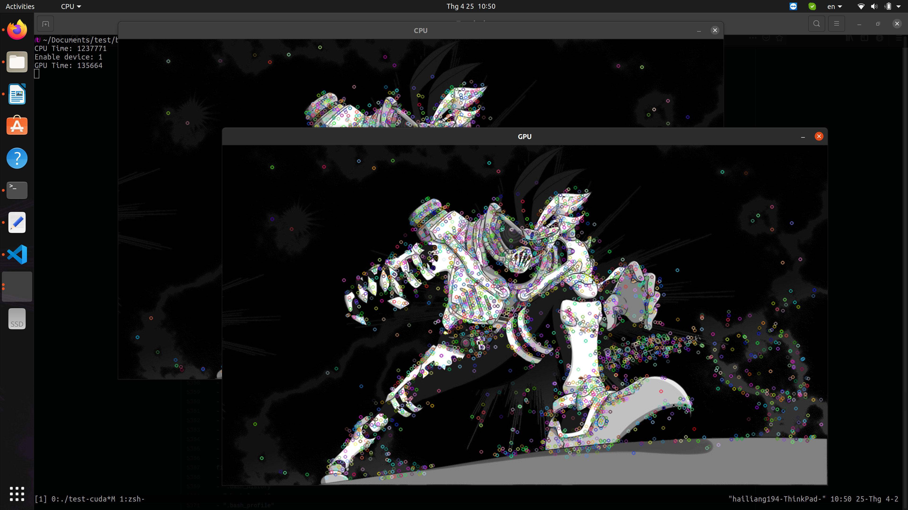
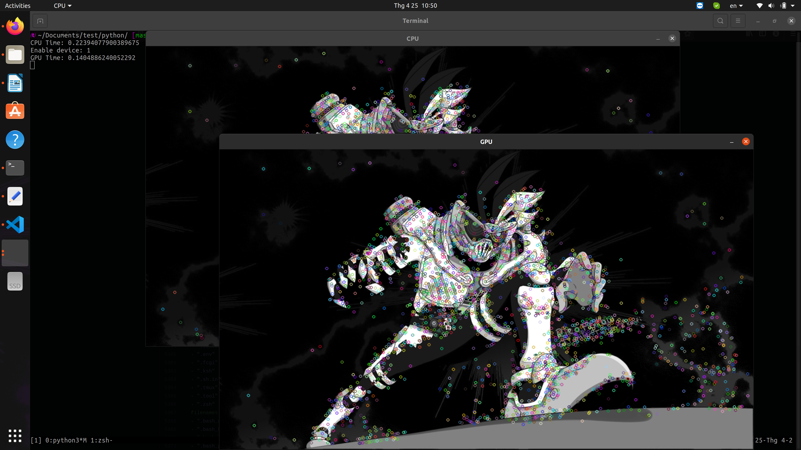

# SURF_Cuda_test
This is used for check if the installed OpenCV is both Non-free and CUDA support or not

## Installation
Clone this repository
```
git clone https://github.com/hailiang194/SURF_Cuda_test.git
```

## Test
### C++ Version
#### Precondition
Make sure you have CMake and OpenCV in Non-free and CUDA support
#### Installation
```sh
mkdir build
cd build
cmake ../ 
make
```
#### Execute
```sh
./test-cuda
```

### Python
#### Precondition
Make sure you have OpenCV in Non-free and CUDA support
#### Execute
```sh
cd python
python3 test.py
```

### Demo
#### C++ Version

#### Python Version
